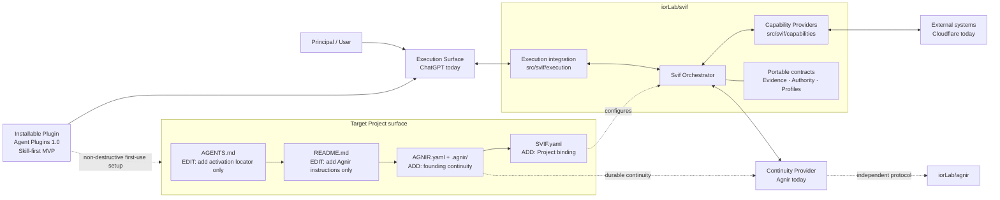
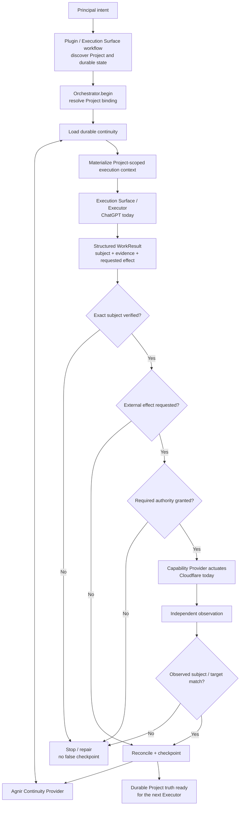

# Svif

**English** | [简体中文](README.zh-CN.md)

Svif is a **Project orchestration product** coordinating durable Project continuity, execution surfaces, and capability providers.

> The Project persists; Executors and execution environments may change.

**Name.** `Svif` is an Icelandic noun meaning flight, hovering, floating, or gliding. The same lexical element appears in `svifryk`, the Icelandic term used for suspended particulate matter. The name reflects Svif's product model: execution can move across Execution Surfaces and Capability Providers without making any one environment the owner of the Project. It also deliberately echoes Agnir's particle metaphor: Agnir names the durable pieces of Project truth; Svif names the motion around them as execution changes while Project continuity persists.

## Start Here

This section is for users. Pick the action that matches what you want to do.

| Goal | What to do |
| --- | --- |
| Use Svif in personal ChatGPT | **Svif is not publicly listed yet.** After publication, install it from the universal Plugins Directory shared by ChatGPT and Codex. |
| Install for development, Codex, or another compatible Agent environment | `Install and enable Svif for this Project: https://github.com/iorLab/svif` |
| Continue with Svif already installed | **No recurring Svif installation prompt is required.** Ask for the actual Project task. |
| Upgrade the Agnir used by this Project | `Upgrade the Agnir used by this Project to the latest stable release: https://github.com/iorLab/agnir` |

A genuinely uninitialized Project does **not** need Agnir to be manually initialized first. On the founding repository/filesystem path, Svif's shared Skill establishes the required Agnir continuity and matching Svif Project Binding as part of first use.

Upgrading Agnir is not the same as upgrading Svif. Compatible Agnir upgrades preserve `SVIF.yaml`, Project identity, and durable Project continuity.

## Agnir Project Instructions

> **For Agents working in this repository.** Users normally do not need to read this section.

1. **Discover.** Treat this repository root as the authorized Project Entry Point. Read top-level `AGNIR.yaml` and validate the declared Agnir Core/profile compatibility and Project identity.
2. **Load.** Load Current State and Next Actions from the durable memory declared by `AGNIR.yaml`. Load Decisions and Evidence when they materially constrain the current operation. Prefer durable Project truth over chat history or private executor memory unless superseded by a newer Principal instruction or a directly observed current Project fact.
3. **Bind Svif.** Read `SVIF.yaml` and the relevant current specifications before changing Svif product behavior. Preserve the configured Continuity Provider, execution, capability, authority, and Project-identity boundaries.
4. **Work / checkpoint.** Perform the actual Project work, then reconcile only material continuity changes at an intentional checkpoint, save-progress, finish, or repository commit boundary. Unchanged durable truth is a no-op. Material changes must form one coherent candidate; reject stale-base publication rather than overwriting newer truth, then verify the locator chain after publication.
5. **Commit / push.** Authorized `commit`, `提交`, `提交代码`, or equivalent intent means checkpoint before commit and preferably one revision for Project + Agnir changes. `commit and push`, `提交推送`, or equivalent adds push plus authoritative-ref verification. Merely observing an external commit triggers checkpoint evaluation, not an unconditional Agnir write.

Root `AGENTS.md` is only the activation locator to this section; it must not become a second copy of Project state or the Agnir procedure. The canonical activation route is:

`Project root -> AGENTS.md -> README.md / Agnir Project Instructions -> AGNIR.yaml -> declared durable memory`

The applied Agnir operational distribution is recorded in `AGNIR.yaml` under `extensions.agnir/operations`; this provenance does not replace Core/profile compatibility or Project identity.

If an activation locator, identity, required memory locator, or compatibility check fails, repair the earliest faulty layer when authorized. Do not invent Project state or silently fall back to chat history, sibling repositories, or retired layouts.

## What Svif Adds to a Project

On first use of Svif in a genuinely uninitialized repository/filesystem Project, the shared Skill establishes the founding Agnir continuity plus a matching Svif Project Binding. **Svif does not take over existing Project files.** Existing `AGENTS.md` and `README.md` receive only the activation/instruction entry they need, while unrelated content is preserved.

```text
Project/
├── AGENTS.md                 # [EDIT: add entry only] add Agnir activation locator; preserve existing instructions
├── README.md                 # [EDIT: add entry only] add ## Agnir Project Instructions; preserve existing content
├── AGNIR.yaml                # [ADD] founding Agnir discovery anchor
├── .agnir/                   # [ADD] Project-owned durable continuity
│   ├── state.md              # [ADD] current durable Project truth
│   ├── next-actions.md       # [ADD] outstanding ordered work for the next Executor
│   ├── decisions.md          # [ADD] durable decisions that constrain future work
│   └── evidence/             # [ADD] recovery/audit/material-claim evidence and checkpoints
└── SVIF.yaml                 # [ADD] Svif Project Binding: continuity, execution, capability and profile bindings
```

If compatible Agnir/Svif artifacts already exist, the Skill validates and reuses them rather than recreating them. Partial or contradictory artifacts are a repair case, not clean initialization. A Project intentionally bound to another Continuity Provider is not silently overwritten with Agnir.

These are founding `repository-filesystem` onboarding artifacts, not universal Svif kernel requirements. Svif coordinates replaceable providers and execution surfaces; it does not make Git, GitHub, Agnir, ChatGPT, or Cloudflare permanent kernel dependencies.

## Architecture Diagram



The Project-surface nodes describe the **first-use onboarding boundary**; the product nodes describe Svif's replaceable runtime roles. Svif owns the coordination boundary. The Orchestrator does not permanently depend on Agnir, ChatGPT, or Cloudflare; they are the founding/current bindings for the Continuity Provider, Execution Surface, and Capability Provider roles.

The active canonical repository topology is deliberately small:

- `iorLab/svif` — the complete Svif product: Orchestrator, integrations, capability providers, installable Plugin packaging, contracts, tests, and E2E fixtures;
- `iorLab/agnir` — the independent Agnir continuity protocol consumed through Svif's Continuity Provider interface.

Provider-specific Svif behavior stays in `iorLab/svif` unless it becomes an independently useful product or protocol in its own right.

## Runtime / Operation Flow



The default internal lifecycle is:

`DISCOVER -> PLAN -> CHANGE -> VERIFY -> DELIVER -> OBSERVE -> CHECKPOINT`

`REPAIR` returns to the earliest violated invariant. For externally driven surfaces such as ChatGPT, `Orchestrator.begin()` creates the bound operation/session and `Orchestrator.complete()` reconciles the returned result. Untrusted model/result payloads cannot self-grant protected authority.

## Installable Plugin MVP

Svif ships a **Skill-first installable Plugin MVP** under `plugin/`, using the portable Agent Plugins 1.0.0 package layout and an additive OpenAI/Codex manifest:

```text
svif/
├── .agents/plugins/marketplace.json
└── plugin/
    ├── plugin.json
    ├── .codex-plugin/plugin.json
    ├── README.md
    └── skills/
        └── svif/
            └── SKILL.md
```

`plugin/plugin.json` remains the portable Agent Plugins manifest. `plugin/.codex-plugin/plugin.json` is the OpenAI/Codex manifest used for the shared Skill and public listing metadata. `.agents/plugins/marketplace.json` remains an auxiliary repository-marketplace path for development, Codex, and managed-workspace testing.

### Personal ChatGPT distribution status

The mature personal-user path remains `ChatGPT -> Plugins Directory -> discover Svif -> install -> invoke`. **Svif is not publicly listed yet**, so this is a target consumer path rather than a currently available production install.

OpenAI's current public submission flow explicitly accepts a **Skills-only** Plugin. Svif's `.codex-plugin/plugin.json` has therefore been tightened to the current final-directory metadata limits, while the existing `plugin/skills/svif/SKILL.md` remains the single shared workflow implementation. MCP/App packaging is not a prerequisite for the initial public submission and must not be added merely to satisfy publication.

There is still **no ChatGPT or Codex client installation that has yet been recorded as validated evidence** for the public personal-user release. Public review approval, publication, directory appearance, installation, invocation, Agnir activation, verification, and checkpoint are separate evidence layers. Installation validation requires an actual supported surface, exact surface/revision evidence when observable, and observed Agnir activation/verification/checkpoint evidence.

See [`plugin/README.md`](plugin/README.md) for public submission prerequisites, proposed listing metadata, review test cases, repository-marketplace development routes, and evidence boundaries.

## Repository Structure

This tree is the practical map of the repository. It is intentionally selective: it shows the directories and key files that explain where each product responsibility lives, rather than listing every fixture or evidence file.

```text
svif/
├── .agents/plugins/                   # auxiliary OpenAI/Codex repository marketplace catalog
│   └── marketplace.json              # maps development/workspace import to the local ./plugin root
│
├── src/                              # executable Svif product code
│   └── svif/
│       ├── runtime.py                # Orchestrator kernel: begin/run/complete, verification, authority, reconciliation
│       ├── continuity/               # Continuity Provider implementations/adapters
│       │   └── agnir.py              # founding Agnir repository/filesystem Continuity Provider
│       ├── execution/                # Execution Surface bridges
│       │   └── chatgpt.py            # founding ChatGPT structured Execution Surface bridge
│       └── capabilities/             # Capability Providers that inspect or affect external systems
│           └── cloudflare.py         # founding Cloudflare Workers Capability Provider
│
├── integrations/                     # platform/provider integration boundaries
│   ├── chatgpt/                      # ChatGPT app/MCP integration around the execution bridge
│   └── cloudflare/                   # Cloudflare descriptor, transport boundary, and integration notes
│
├── plugin/                           # installable Agent Plugins 1.0 distribution package
│   ├── plugin.json                   # portable Plugin manifest
│   ├── .codex-plugin/plugin.json     # OpenAI/Codex + public-directory listing metadata
│   ├── README.md                     # public submission, package validation, installation and evidence guidance
│   └── skills/svif/SKILL.md          # shared Svif Project-orchestration workflow Skill
│
├── spec/                             # portable product contracts used by the Orchestrator and integrations
├── profiles/                         # specialized behavior layered on portable contracts
├── schemas/                          # machine-readable serializations of Svif contracts
├── tests/                            # runtime, provider, surface, continuity, Plugin, and E2E tests
├── conformance/                      # portable-contract conformance checks and fixtures
├── checks/                           # repository/product-integrity checks
├── history/                          # predecessor and retired-project evidence; not active runtime dependencies
│
├── .agnir/                           # this Svif Project's canonical state, next actions, decisions, and evidence
├── .github/workflows/                # CI that runs repository, runtime, and conformance checks
├── AGENTS.md                         # minimal Agnir activation locator to this README's Project Instructions
├── AGNIR.yaml                        # locates this Project's Agnir continuity under the current filesystem profile
├── SVIF.yaml                         # repository/filesystem serialization of this Project's Svif binding
├── ARCHITECTURE.md                   # detailed product architecture and dependency boundaries
├── README.md                         # English project entry point and canonical Agnir Project Instructions
├── README.zh-CN.md                   # Simplified Chinese project entry point
└── VERSION                           # current Svif development version
```

For the fully expanded file-by-file map of the current `main`, including responsibility annotations for every tracked file, see **[REPOSITORY_TREE.md](REPOSITORY_TREE.md)**.

Python is the current executable reference vehicle; it does not freeze the eventual distribution technology. The installable Plugin is now an active product artifact rather than a future-only target.

## Current founding path

- Agnir repository/filesystem continuity adapter exists.
- ChatGPT structured execution bridge supports externally driven `Orchestrator.begin()` / `Orchestrator.complete()` handoff.
- Cloudflare provider logic is owned by Svif and uses an injected transport boundary, so tests do not require live credentials.
- `tests/test_founding_e2e.py` composes all three through the real Orchestrator boundary.
- `plugin/plugin.json` + `plugin/skills/svif/SKILL.md` remain the portable Plugin MVP package.
- `plugin/.codex-plugin/plugin.json` now also satisfies the public-directory listing limits currently guarded by repository tests.
- `.agents/plugins/marketplace.json` remains an auxiliary repository-backed OpenAI/Codex development route, not the primary personal ChatGPT onboarding path.
- Protected authority remains outside untrusted model/result payloads.
- External success requires exact verified-subject delivery plus independent observation before checkpoint.

The founding E2E is intentionally credential-free. It proves the Svif product loop and provider boundaries, not live Cloudflare production delivery.

## Project binding

`SVIF.yaml` is the repository/filesystem serialization of `project-binding/0.2` for this Project. It also registers the current product-owned Plugin artifacts while keeping continuity, execution, and capability bindings replaceable.

## Documentation synchronization

`README.md` and `README.zh-CN.md` are maintained as parallel entry points. Any change to product architecture, component ownership, dependency direction, authority/provenance boundaries, runtime flow, distribution status, or documented repository structure **must update both language versions in the same change set**.

Before the Architecture Diagram, README content is deliberately limited to **Start Here** for users, the canonical **Agnir Project Instructions** for Agents, and **What Svif Adds to a Project** as the concrete first-use Project-surface explanation. The Architecture Diagram mirrors that non-destructive first-use boundary; Runtime / Operation Flow remains a post-bootstrap runtime view and does not carry installation-mutation labels. Publication workflow, Plugin packaging rationale, compatibility detail, and implementation explanation belong after the architecture entry point or in dedicated documents.

The exhaustive companion **`REPOSITORY_TREE.md`** is the file-level map of the active repository and must be updated whenever tracked files are added, removed, moved, or materially change responsibility.

## Checks

```bash
python checks/check_repository.py
python conformance/check_contracts.py
PYTHONPATH=src python -m unittest discover -s tests -v
```

## Next

The repository-side public-distribution path is now clear: **prepare and submit the existing Skills-only Plugin through the OpenAI Platform plugin submission portal.** The remaining external publication prerequisites are an OpenAI Platform publisher with Apps Management write access and a verified individual/business identity. After portal submission, record the skill scan/review result; after approval, explicitly publish; then run the first personal ChatGPT Web install/invocation exercise from the universal Plugins Directory. MCP/App packaging remains a later capability increment, not a release gate. Live Cloudflare actuation remains separately gated.