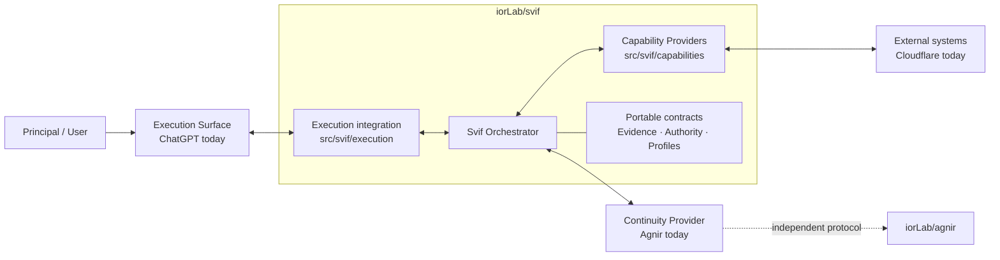
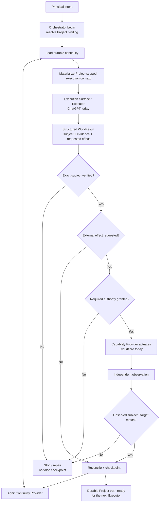

# Svif

**English** | [简体中文](README.zh-CN.md)

Svif is a **Project orchestration product** coordinating durable Project continuity, execution surfaces, and capability providers.

> The Project persists; Executors and execution environments may change.

## Architecture Diagram



Svif owns the coordination boundary. The Orchestrator does not permanently depend on Agnir, ChatGPT, or Cloudflare; they are the founding/current bindings for the Continuity Provider, Execution Surface, and Capability Provider roles.

The active canonical repository topology is deliberately small:

- `iorLab/svif` — the complete Svif product: Orchestrator, integrations, capability providers, contracts, tests, and E2E fixtures;
- `iorLab/agnir` — the independent Agnir continuity protocol consumed through Svif's Continuity Provider interface.

Provider-specific Svif behavior stays in `iorLab/svif` unless it becomes an independently useful product or protocol in its own right.

## Runtime / Operation Flow



The default internal lifecycle is:

`DISCOVER -> PLAN -> CHANGE -> VERIFY -> DELIVER -> OBSERVE -> CHECKPOINT`

`REPAIR` returns to the earliest violated invariant. For externally driven surfaces such as ChatGPT, `Orchestrator.begin()` creates the bound operation/session and `Orchestrator.complete()` reconciles the returned result. Untrusted model/result payloads cannot self-grant protected authority.

## Repository Structure

This tree is the practical map of the repository. It is intentionally selective: it shows the directories and key files that explain where each product responsibility lives, rather than listing every fixture or evidence file.

```text
svif/
├── src/                              # executable Svif product code
│   └── svif/
│       ├── runtime.py                # Orchestrator kernel: begin/run/complete, verification, authority, reconciliation
│       ├── continuity/               # Continuity Provider implementations/adapters
│       │   └── agnir.py              # founding Agnir repository/filesystem Continuity Provider
│       ├── execution/                # Execution Surface bridges
│       │   └── chatgpt.py            # founding ChatGPT structured Execution Surface bridge
│       └── capabilities/             # Capability Providers that inspect or affect external systems
│           └── cloudflare.py         # founding Cloudflare Workers Capability Provider
│
├── integrations/                     # platform/provider packaging and integration boundaries
│   ├── chatgpt/                      # ChatGPT app/MCP integration material around the execution bridge
│   └── cloudflare/                   # Cloudflare descriptor, transport boundary, and integration notes
│
├── spec/                             # portable product contracts used by the Orchestrator and integrations
│   ├── CORE.md                       # orchestration lifecycle and kernel invariants
│   ├── PROJECT_BINDING.md            # how a Project selects continuity/execution/capability bindings
│   ├── EVIDENCE.md                   # evidence and provenance semantics
│   └── CAPABILITY_ADAPTER.md         # Capability Provider contract
│
├── profiles/                         # specialized behavior layered on the portable contracts
│   └── SOFTWARE_DELIVERY.md          # current software-delivery specialization
├── schemas/                          # machine-readable serializations of Svif contracts
├── tests/                            # runtime, provider, surface, continuity, and founding E2E tests
├── conformance/                      # portable-contract conformance checks and fixtures
├── checks/                           # repository/product-integrity checks
├── history/                          # predecessor and retired-project evidence; not active runtime dependencies
│
├── .agnir/                           # this Svif Project's canonical state, next actions, decisions, and evidence
├── .github/workflows/                # CI that runs repository, runtime, and conformance checks
├── AGNIR.yaml                        # locates this Project's Agnir continuity under the current filesystem profile
├── SVIF.yaml                         # repository/filesystem serialization of this Project's Svif binding
├── ARCHITECTURE.md                   # detailed product architecture and dependency boundaries
├── README.md                         # English project entry point
├── README.zh-CN.md                   # Simplified Chinese project entry point
└── VERSION                           # current Svif development version
```

For the fully expanded file-by-file map of the current `main`, including responsibility annotations for every tracked file, see **[目录树.md](目录树.md)**.

Python is the current executable reference vehicle; it does not freeze the eventual distribution technology. The mature distribution target remains an installable Plugin; the current ChatGPT app/MCP work is the founding Execution Surface integration, not a replacement for that product target.

## Current founding path

- Agnir repository/filesystem continuity adapter exists.
- ChatGPT structured execution bridge supports externally driven `Orchestrator.begin()` / `Orchestrator.complete()` handoff.
- Cloudflare provider logic is owned by Svif and uses an injected transport boundary, so tests do not require live credentials.
- `tests/test_founding_e2e.py` now composes all three through the real Orchestrator boundary: continuity is loaded from an Agnir Project, the ChatGPT bridge materializes and parses the structured operation, trusted integration authority is supplied at completion, Cloudflare delivery is actuated and independently observed through fake non-secret transport, and the resulting state/evidence is checkpointed back through Agnir.
- Protected authority remains outside untrusted model/result payloads.
- External success requires exact verified-subject delivery plus independent observation before checkpoint.

The founding E2E is intentionally credential-free. It proves the Svif product loop and provider boundaries, not live Cloudflare production delivery.

## Project binding

`SVIF.yaml` is the repository/filesystem serialization of `project-binding/0.2` for this Project. It describes product-owned implementation artifacts while keeping continuity, execution, and capability bindings replaceable.

## Documentation synchronization

`README.md` and `README.zh-CN.md` are maintained as parallel entry points. Any change to product architecture, component ownership, dependency direction, authority/provenance boundaries, or runtime flow **must update the affected README diagrams in the same change set**. The diagrams describe current architecture, not historical snapshots.

The plain-text **Repository Structure** tree is maintained under the same rule as a compact navigation view. The exhaustive companion **`目录树.md`** is the file-level map of the active repository and must be updated whenever tracked files are added, removed, moved, or materially change responsibility. If that change affects the compact tree, both README language versions must update it in the same change set as well.

## Checks

```bash
python checks/check_repository.py
python conformance/check_contracts.py
PYTHONPATH=src python -m unittest discover -s tests -v
```

## Next

The next milestone is hardening the concrete ChatGPT app/MCP packaging around the now-executable founding product loop. After that: broader neutrality evidence, multi-project isolation with Agnir, and release compatibility work. Live Cloudflare actuation remains separately gated and is not required for the credential-free founding E2E.
