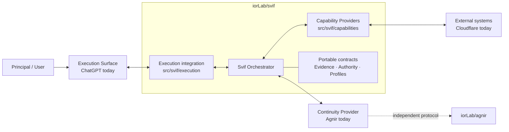
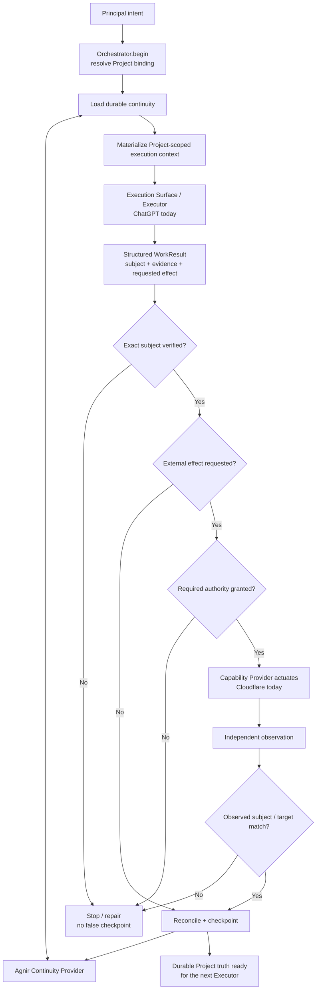

# Svif

**English** | [简体中文](README.zh-CN.md)

Svif is a **Project orchestration product** coordinating durable Project continuity, execution surfaces, and capability providers.

> The Project persists; Executors and execution environments may change.

## Architecture Diagram



Svif owns the coordination boundary. The Orchestrator does not permanently depend on Agnir, ChatGPT, or Cloudflare; they are the founding/current bindings for the Continuity Provider, Execution Surface, and Capability Provider roles.

The active canonical repository topology is deliberately small:

- `iorLab/svif` — the complete Svif product: Orchestrator, integrations, capability providers, contracts, tests, and E2E fixtures;
- `iorLab/agnir` — the independent Agnir continuity protocol consumed through Svif's Continuity Provider interface.

Provider-specific Svif behavior stays in `iorLab/svif` unless it becomes an independently useful product or protocol in its own right.

## Runtime / Operation Flow



The default internal lifecycle is:

`DISCOVER -> PLAN -> CHANGE -> VERIFY -> DELIVER -> OBSERVE -> CHECKPOINT`

`REPAIR` returns to the earliest violated invariant. For externally driven surfaces such as ChatGPT, `Orchestrator.begin()` creates the bound operation/session and `Orchestrator.complete()` reconciles the returned result. Untrusted model/result payloads cannot self-grant protected authority.

## Repository layout

```text
src/svif/runtime.py                    # Orchestrator kernel
src/svif/continuity/agnir.py           # Agnir Continuity Provider
src/svif/execution/chatgpt.py          # ChatGPT Execution Surface bridge
src/svif/capabilities/cloudflare.py    # Svif-owned Cloudflare Capability Provider

integrations/chatgpt/                  # ChatGPT app/MCP packaging boundary
integrations/cloudflare/               # Cloudflare provider descriptor and integration notes

tests/                                # runtime/provider/surface behavior
conformance/                          # portable contract conformance
spec/                                 # internal portable contracts
profiles/                             # specializations
schemas/                              # machine-readable contracts
history/                              # predecessor/retired-project evidence only
```

Python is the current executable reference vehicle; it does not freeze the eventual distribution technology.

## Current founding path

- Agnir repository/filesystem continuity adapter exists.
- ChatGPT structured execution bridge supports externally driven `Orchestrator.begin()` / `Orchestrator.complete()` handoff.
- Cloudflare provider logic is owned by Svif and uses an injected transport boundary, so tests do not require live credentials.
- Protected authority remains outside untrusted model/result payloads.
- External success requires exact verified-subject delivery plus independent observation before checkpoint.

## Project binding

`SVIF.yaml` is the repository/filesystem serialization of `project-binding/0.2` for this Project. It describes product-owned implementation artifacts while keeping continuity, execution, and capability bindings replaceable.

## Documentation synchronization

`README.md` and `README.zh-CN.md` are maintained as parallel entry points. Any change to product architecture, component ownership, dependency direction, authority/provenance boundaries, or runtime flow **must update the affected README diagrams in the same change set**. The diagrams describe current architecture, not historical snapshots.

## Checks

```bash
python checks/check_repository.py
python conformance/check_contracts.py
PYTHONPATH=src python -m unittest discover -s tests -v
```

## Next

The next milestone is one in-repository founding E2E scenario wiring Agnir + ChatGPT + Cloudflare through the Orchestrator. After that: ChatGPT packaging hardening, broader neutrality evidence, and release compatibility work.
