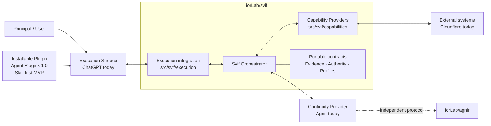
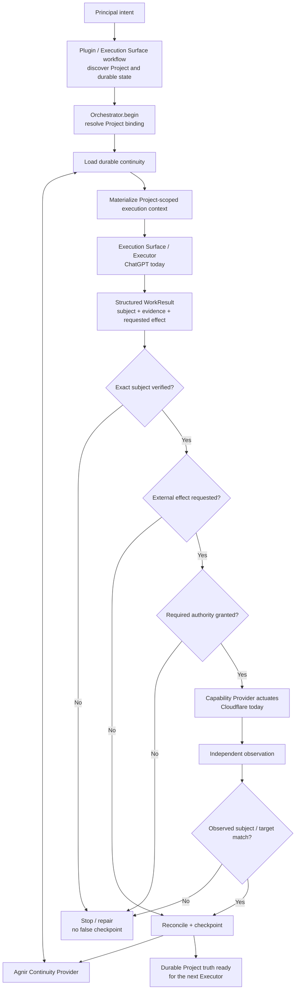

# Svif

**English** | [简体中文](README.zh-CN.md)

Svif is a **Project orchestration product** coordinating durable Project continuity, execution surfaces, and capability providers.

> The Project persists; Executors and execution environments may change.

## Agnir Project Instructions

Treat this repository root as the authorized Project Entry Point for the Svif Project. Before substantive Project work:

1. Read top-level `AGNIR.yaml` and validate the declared Agnir Core/profile compatibility and Project identity.
2. Load Current State and Next Actions from the durable memory locations declared by `AGNIR.yaml`.
3. Load Decisions and Evidence when they materially constrain the current operation.
4. Prefer durable Agnir Project truth over chat history or private executor memory unless superseded by a newer Principal instruction or a directly observed current Project fact.
5. For Svif work, then read `SVIF.yaml` and the relevant current specifications before changing product behavior.
6. Checkpoint material state, next-action, decision, and evidence changes when saving progress or finishing work, and verify that the locator chain still resolves for a fresh executor.

Root `AGENTS.md` is only the activation locator to this section; it must not become a second copy of Project state or the Agnir procedure. The expected activation route is:

`Project root -> AGENTS.md -> README.md / Agnir Project Instructions -> AGNIR.yaml -> declared durable memory`

If any activation locator, identity, required memory locator, or compatibility check fails, repair the earliest faulty layer when authorized. Do not invent Project state or silently fall back to chat history, sibling repositories, or retired layouts.

## Architecture Diagram



Svif owns the coordination boundary. The Orchestrator does not permanently depend on Agnir, ChatGPT, or Cloudflare; they are the founding/current bindings for the Continuity Provider, Execution Surface, and Capability Provider roles.

The active canonical repository topology is deliberately small:

- `iorLab/svif` — the complete Svif product: Orchestrator, integrations, capability providers, installable Plugin packaging, contracts, tests, and E2E fixtures;
- `iorLab/agnir` — the independent Agnir continuity protocol consumed through Svif's Continuity Provider interface.

Provider-specific Svif behavior stays in `iorLab/svif` unless it becomes an independently useful product or protocol in its own right.

## Runtime / Operation Flow



The default internal lifecycle is:

`DISCOVER -> PLAN -> CHANGE -> VERIFY -> DELIVER -> OBSERVE -> CHECKPOINT`

`REPAIR` returns to the earliest violated invariant. For externally driven surfaces such as ChatGPT, `Orchestrator.begin()` creates the bound operation/session and `Orchestrator.complete()` reconciles the returned result. Untrusted model/result payloads cannot self-grant protected authority.

## Installable Plugin MVP

Svif now ships a **Skill-first installable Plugin MVP** under `plugin/`, using the portable Agent Plugins 1.0.0 package layout.

```text
plugin/
├── plugin.json
├── README.md
└── skills/
    └── svif/
        └── SKILL.md
```

The portable package is ready for supported-client installation exercises, but **no ChatGPT or Codex client installation has yet been recorded as validated evidence for this revision**. Client/surface availability, workspace policy, import or directory access, invocation, Agnir activation, verification, and checkpoint behavior must be observed on the actual product surface before installation is called validated.

The Plugin guides the executor to discover Agnir first, run real Project work through the Svif lifecycle, preserve verification/provenance and trusted authority boundaries, independently observe external effects, and checkpoint durable truth. It does not duplicate the Orchestrator and does not make an execution surface canonical memory.

The first release is deliberately Skill-only. `mcp.json` will be added when the remote Svif MCP/App component is ready to reuse the existing `Orchestrator.begin()` / `Orchestrator.complete()` boundary. MCP is an enhancement, not a gate for beginning Plugin package validation and real-client exercises.

See [`plugin/README.md`](plugin/README.md) for the portable package checks, client-dependent installation exercise, and evidence boundary.

## Repository Structure

This tree is the practical map of the repository. It is intentionally selective: it shows the directories and key files that explain where each product responsibility lives, rather than listing every fixture or evidence file.

```text
svif/
├── src/                              # executable Svif product code
│   └── svif/
│       ├── runtime.py                # Orchestrator kernel: begin/run/complete, verification, authority, reconciliation
│       ├── continuity/               # Continuity Provider implementations/adapters
│       │   └── agnir.py              # founding Agnir repository/filesystem Continuity Provider
│       ├── execution/                # Execution Surface bridges
│       │   └── chatgpt.py            # founding ChatGPT structured Execution Surface bridge
│       └── capabilities/             # Capability Providers that inspect or affect external systems
│           └── cloudflare.py         # founding Cloudflare Workers Capability Provider
│
├── integrations/                     # platform/provider integration boundaries
│   ├── chatgpt/                      # ChatGPT app/MCP integration around the execution bridge
│   └── cloudflare/                   # Cloudflare descriptor, transport boundary, and integration notes
│
├── plugin/                           # installable Agent Plugins 1.0 distribution package
│   ├── plugin.json                   # portable Plugin manifest
│   ├── README.md                     # package conformance, client exercise, and evidence-boundary notes
│   └── skills/svif/SKILL.md          # Svif Project-orchestration workflow Skill
│
├── spec/                             # portable product contracts used by the Orchestrator and integrations
├── profiles/                         # specialized behavior layered on portable contracts
├── schemas/                          # machine-readable serializations of Svif contracts
├── tests/                            # runtime, provider, surface, continuity, Plugin, and E2E tests
├── conformance/                      # portable-contract conformance checks and fixtures
├── checks/                           # repository/product-integrity checks
├── history/                          # predecessor and retired-project evidence; not active runtime dependencies
│
├── .agnir/                           # this Svif Project's canonical state, next actions, decisions, and evidence
├── .github/workflows/                # CI that runs repository, runtime, and conformance checks
├── AGENTS.md                         # minimal Agnir activation locator to this README's Project Instructions
├── AGNIR.yaml                        # locates this Project's Agnir continuity under the current filesystem profile
├── SVIF.yaml                         # repository/filesystem serialization of this Project's Svif binding
├── ARCHITECTURE.md                   # detailed product architecture and dependency boundaries
├── README.md                         # English project entry point and canonical Agnir Project Instructions
├── README.zh-CN.md                   # Simplified Chinese project entry point
└── VERSION                           # current Svif development version
```

For the fully expanded file-by-file map of the current `main`, including responsibility annotations for every tracked file, see **[REPOSITORY_TREE.md](REPOSITORY_TREE.md)**.

Python is the current executable reference vehicle; it does not freeze the eventual distribution technology. The installable Plugin is now an active product artifact rather than a future-only target.

## Current founding path

- Agnir repository/filesystem continuity adapter exists.
- ChatGPT structured execution bridge supports externally driven `Orchestrator.begin()` / `Orchestrator.complete()` handoff.
- Cloudflare provider logic is owned by Svif and uses an injected transport boundary, so tests do not require live credentials.
- `tests/test_founding_e2e.py` composes all three through the real Orchestrator boundary.
- `plugin/plugin.json` + `plugin/skills/svif/SKILL.md` now form the first installable Plugin MVP package; real ChatGPT/Codex installation evidence is still pending.
- `tests/test_plugin_package.py` verifies the package baseline and ensures the distribution layer does not shadow the runtime.
- Protected authority remains outside untrusted model/result payloads.
- External success requires exact verified-subject delivery plus independent observation before checkpoint.

The founding E2E is intentionally credential-free. It proves the Svif product loop and provider boundaries, not live Cloudflare production delivery.

## Project binding

`SVIF.yaml` is the repository/filesystem serialization of `project-binding/0.2` for this Project. It also registers the current product-owned Plugin artifacts while keeping continuity, execution, and capability bindings replaceable.

## Documentation synchronization

`README.md` and `README.zh-CN.md` are maintained as parallel entry points. Any change to product architecture, component ownership, dependency direction, authority/provenance boundaries, runtime flow, or documented repository structure **must update both language versions in the same change set**.

The exhaustive companion **`REPOSITORY_TREE.md`** is the file-level map of the active repository and must be updated whenever tracked files are added, removed, moved, or materially change responsibility.

## Checks

```bash
python checks/check_repository.py
python conformance/check_contracts.py
PYTHONPATH=src python -m unittest discover -s tests -v
```

## Next

The next milestone is no longer “prepare for Plugin packaging.” The Plugin exists. Next is **install/use/repair iteration**: exercise the Skill-first Plugin on an actual supported client and real Project, record the exact surface/revision and observed Agnir activation/verification/checkpoint evidence, repair observed friction, and then add the remote ChatGPT MCP/App component without duplicating kernel semantics. Live Cloudflare actuation remains separately gated.
