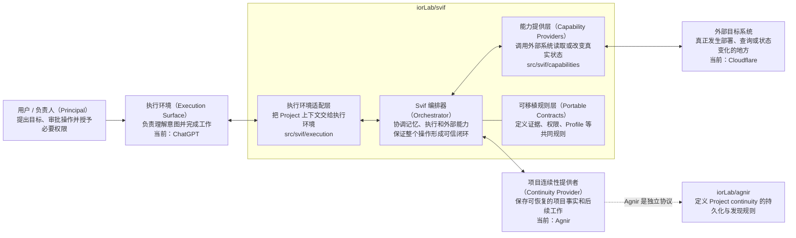
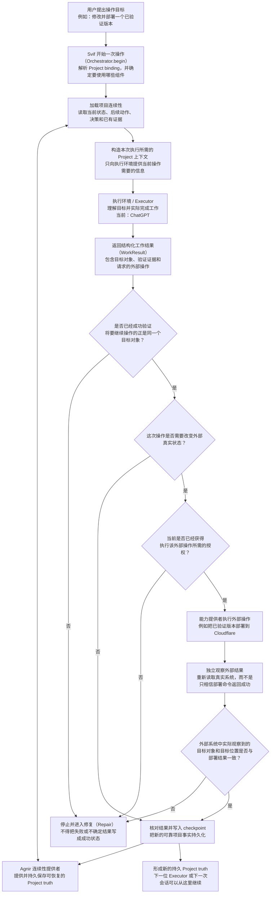

# Svif

[English](README.md) | **简体中文**

Svif 是一个 **Project orchestration（项目编排）产品**，负责协调持久化的 Project continuity、执行表面（Execution Surface）和能力提供者（Capability Provider）。

> Project 持续存在；Executor 和执行环境可以变化。

## 架构图（Architecture Diagram）



Svif 自己负责的是三类可替换边界之间的协调。Orchestrator 并不永久依赖 Agnir、ChatGPT 或 Cloudflare；它们分别是 Continuity Provider、Execution Surface 和 Capability Provider 的首批/当前 binding。

当前 canonical repository 拓扑刻意保持最小：

- `iorLab/svif` —— 完整 Svif 产品，包括 Orchestrator、integrations、capability providers、contracts、tests 和 E2E fixtures；
- `iorLab/agnir` —— 独立的 Agnir continuity protocol，Svif 通过 Continuity Provider interface 使用它。

Provider-specific 的 Svif 行为应留在 `iorLab/svif` 内，除非它未来本身成为一个具有独立价值的产品或协议。

## 运行流程（Runtime / Operation Flow）



默认内部生命周期为：

`DISCOVER -> PLAN -> CHANGE -> VERIFY -> DELIVER -> OBSERVE -> CHECKPOINT`

`REPAIR` 返回到最早被破坏的 invariant。对于 ChatGPT 这类 externally driven surface，`Orchestrator.begin()` 建立绑定后的 operation/session，`Orchestrator.complete()` 负责校验并 reconcile 返回结果。来自模型或结果 payload 的不可信数据不能自行授予 protected authority。

## 仓库结构

```text
src/svif/runtime.py                    # Orchestrator kernel
src/svif/continuity/agnir.py           # Agnir Continuity Provider
src/svif/execution/chatgpt.py          # ChatGPT Execution Surface bridge
src/svif/capabilities/cloudflare.py    # Svif-owned Cloudflare Capability Provider

integrations/chatgpt/                  # ChatGPT app/MCP packaging boundary
integrations/cloudflare/               # Cloudflare provider descriptor / integration notes

tests/                                # runtime/provider/surface behavior
conformance/                          # portable contract conformance
spec/                                 # 内部 portable contracts
profiles/                             # specializations
schemas/                              # machine-readable contracts
history/                              # predecessor / retired-project evidence
```

Python 目前只是可执行 reference vehicle，并不冻结未来 Plugin/产品分发采用的技术栈。

## 当前 founding path

- 已有 Agnir repository/filesystem Continuity Provider adapter。
- 已有 ChatGPT structured execution bridge，支持 externally driven 的 `Orchestrator.begin()` / `Orchestrator.complete()` handoff。
- Cloudflare provider 已归 Svif 自己所有，并使用 injected transport boundary，因此测试不需要 live credentials。
- Protected authority 不来自不可信的 model/result payload。
- 外部成功必须满足 exact verified-subject delivery，并经过 independent observation 后才能 checkpoint。

## Project binding

`SVIF.yaml` 是本 Project 对 `project-binding/0.2` 的 repository/filesystem serialization。它描述 Svif 产品自身实现，同时保持 continuity、execution 和 capability bindings 可替换。

## 文档同步规则

`README.md` 与 `README.zh-CN.md` 是并行维护的项目入口。只要产品架构、组件归属、依赖方向、authority/provenance boundary 或运行流程发生变化，**同一个 change set 必须同步更新受影响的 README 架构图和运行流程图**。这些图描述的是当前架构，而不是历史快照。

中文版图表还有一条额外规则：**节点必须优先让中文读者直接看懂“这个东西是什么、负责什么”，英文术语只作为括注或代码/API 名称保留，不得用生硬直译替代解释。**

## 检查

```bash
python checks/check_repository.py
python conformance/check_contracts.py
PYTHONPATH=src python -m unittest discover -s tests -v
```

## 下一步

下一里程碑是在本仓库内完成 Agnir + ChatGPT + Cloudflare 通过 Orchestrator 的 founding E2E scenario。之后再进行 ChatGPT packaging hardening、更广泛的 neutrality evidence 和 release compatibility 工作。
