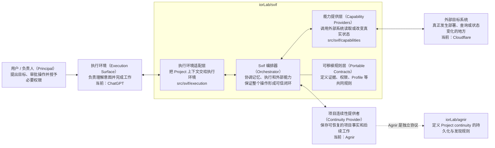
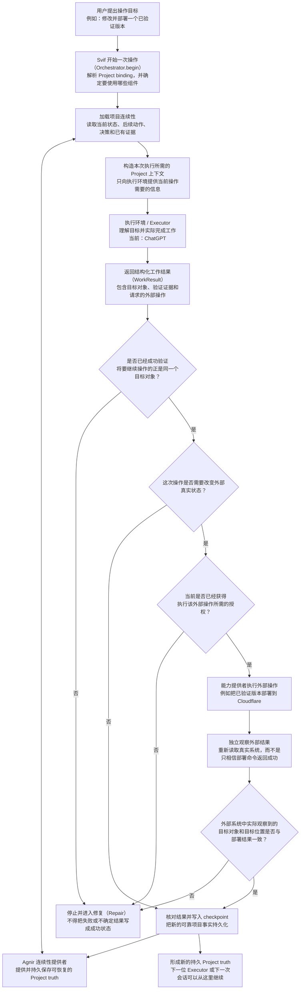

# Svif

[English](README.md) | **简体中文**

Svif 是一个 **Project orchestration（项目编排）产品**，负责协调持久化的 Project continuity、执行表面（Execution Surface）和能力提供者（Capability Provider）。

> Project 持续存在；Executor 和执行环境可以变化。

## 架构图（Architecture Diagram）



Svif 自己负责的是三类可替换边界之间的协调。Orchestrator 并不永久依赖 Agnir、ChatGPT 或 Cloudflare；它们分别是 Continuity Provider、Execution Surface 和 Capability Provider 的首批/当前 binding。

当前 canonical repository 拓扑刻意保持最小：

- `iorLab/svif` —— 完整 Svif 产品，包括 Orchestrator、integrations、capability providers、contracts、tests 和 E2E fixtures；
- `iorLab/agnir` —— 独立的 Agnir continuity protocol，Svif 通过 Continuity Provider interface 使用它。

Provider-specific 的 Svif 行为应留在 `iorLab/svif` 内，除非它未来本身成为一个具有独立价值的产品或协议。

## 运行流程（Runtime / Operation Flow）



默认内部生命周期为：

`DISCOVER -> PLAN -> CHANGE -> VERIFY -> DELIVER -> OBSERVE -> CHECKPOINT`

`REPAIR` 返回到最早被破坏的 invariant。对于 ChatGPT 这类 externally driven surface，`Orchestrator.begin()` 建立绑定后的 operation/session，`Orchestrator.complete()` 负责校验并 reconcile 返回结果。来自模型或结果 payload 的不可信数据不能自行授予 protected authority。

## 仓库结构

下面这棵树就是仓库的实用导航。它不会穷举每一个测试 fixture 或 evidence 文件，只展开到足以说明“哪个目录负责什么、关键代码在哪里”的层级。

```text
svif/
├── src/                              # Svif 可执行产品代码
│   └── svif/
│       ├── runtime.py                # Orchestrator 核心：begin/run/complete、验证、权限与结果核对
│       ├── continuity/               # Continuity Provider 的实现 / 适配层
│       │   └── agnir.py              # 当前首个实现：Agnir repository/filesystem 连续性提供者
│       ├── execution/                # Execution Surface 的桥接层
│       │   └── chatgpt.py            # 当前首个实现：ChatGPT 结构化执行桥接
│       └── capabilities/             # 读取或改变外部真实系统的 Capability Providers
│           └── cloudflare.py         # 当前首个实现：Cloudflare Workers Capability Provider
│
├── integrations/                     # 面向具体平台 / provider 的集成与产品包装边界
│   ├── chatgpt/                      # ChatGPT app/MCP 集成材料，包在 execution bridge 外层
│   └── cloudflare/                   # Cloudflare descriptor、transport 边界和集成说明
│
├── spec/                             # Orchestrator 与 integrations 共同遵守的可移植产品 contracts
│   ├── CORE.md                       # 编排生命周期与核心 invariants
│   ├── PROJECT_BINDING.md            # 一个 Project 如何选择 continuity/execution/capability bindings
│   ├── EVIDENCE.md                   # evidence 与 provenance 语义
│   └── CAPABILITY_ADAPTER.md         # Capability Provider contract
│
├── profiles/                         # 在通用 contracts 上叠加的专门化行为
│   └── SOFTWARE_DELIVERY.md          # 当前的软件交付 specialization
├── schemas/                          # Svif contracts 的机器可读 serialization / schema
├── tests/                            # runtime、provider、surface、continuity 与 founding E2E 测试
├── conformance/                      # 可移植 contract 的一致性检查和 fixtures
├── checks/                           # 检查整个仓库 / 产品结构是否仍满足既定边界
├── history/                          # 前身与已退休项目的历史证据；不属于 active runtime dependency
│
├── .agnir/                           # 这个 Svif Project 自己的 canonical state / next actions / decisions / evidence
├── .github/workflows/                # CI：运行 repository、runtime 和 conformance 检查
├── AGNIR.yaml                        # 在当前 filesystem profile 下定位本 Project 的 Agnir continuity
├── SVIF.yaml                         # 本 Project 的 Svif Project Binding 的 repository/filesystem 表达
├── ARCHITECTURE.md                   # 更详细的产品架构、依赖方向和边界说明
├── README.md                         # 英文项目入口
├── README.zh-CN.md                   # 简体中文项目入口
└── VERSION                           # 当前 Svif development version
```

需要查看当前 `main` 的**完整文件级展开**（包含每个 tracked 文件及其职责说明），请看 **[完整目录树：REPOSITORY_TREE.md](REPOSITORY_TREE.md)**。

Python 目前只是可执行 reference vehicle，并不冻结未来的分发技术。Svif 成熟产品的分发目标仍然是 **installable Plugin**；当前 ChatGPT app/MCP 工作是首个 Execution Surface integration，不是对 Plugin 产品目标的替代。

## 当前 founding path

- 已有 Agnir repository/filesystem Continuity Provider adapter。
- 已有 ChatGPT structured execution bridge，支持 externally driven 的 `Orchestrator.begin()` / `Orchestrator.complete()` handoff。
- Cloudflare provider 已归 Svif 自己所有，并使用 injected transport boundary，因此测试不需要 live credentials。
- `tests/test_founding_e2e.py` 已把三者通过真实 Orchestrator 边界串起来：从 Agnir Project 读取 continuity，由 ChatGPT bridge 构造并解析结构化操作，在完成阶段由可信 integration 层授予 protected authority，再通过无密钥 fake transport 执行 Cloudflare delivery 和独立 observation，最后把新的 state / next actions / decisions 和 operation evidence checkpoint 回 Agnir。
- Protected authority 不来自不可信的 model/result payload。
- 外部成功必须满足 exact verified-subject delivery，并经过 independent observation 后才能 checkpoint。

这个 founding E2E 刻意不使用真实 Cloudflare 凭据。它证明的是 Svif 产品闭环和各边界语义已经可执行，而不是声称已完成真实生产部署。

## Project binding

`SVIF.yaml` 是本 Project 对 `project-binding/0.2` 的 repository/filesystem serialization。它描述 Svif 产品自身实现，同时保持 continuity、execution 和 capability bindings 可替换。

## 文档同步规则

`README.md` 与 `README.zh-CN.md` 是并行维护的项目入口。只要产品架构、组件归属、依赖方向、authority/provenance boundary 或运行流程发生变化，**同一个 change set 必须同步更新受影响的 README 架构图和运行流程图**。这些图描述的是当前架构，而不是历史快照。

纯文本的**仓库结构树**继续作为快速导航，保持简洁；完整文件级结构则由 **`REPOSITORY_TREE.md`** 维护。只要 tracked 文件被新增、删除、移动，或者职责发生实质变化，必须在同一个 change set 中更新 `REPOSITORY_TREE.md`；如果变化也影响 README 的简略树，则中英文 README 必须同时更新。

中文版图表继续遵循理解优先原则：**节点必须优先让中文读者直接看懂“这个东西是什么、负责什么”，英文术语只作为括注或代码/API 名称保留，不得用生硬直译替代解释。**

## 检查

```bash
python checks/check_repository.py
python conformance/check_contracts.py
PYTHONPATH=src python -m unittest discover -s tests -v
```

## 下一步

下一里程碑是围绕已经可执行的 founding product loop，完善具体的 ChatGPT app/MCP packaging。之后再推进更广泛的 neutrality evidence、与 Agnir 对齐的 multi-project isolation，以及 release compatibility。真实 Cloudflare actuation 仍然单独受权限门控，不是 credential-free founding E2E 的前提。
