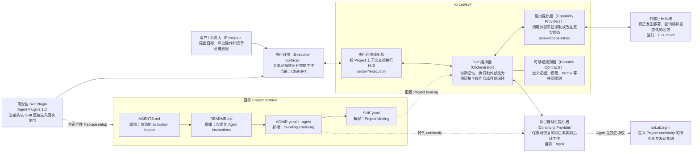

# Svif

[English](README.md) | **简体中文**

Svif 是一个 **Project orchestration（项目编排）产品**，负责协调持久化的 Project continuity、执行表面（Execution Surface）和能力提供者（Capability Provider）。

> Project 持续存在；Executor 和执行环境可以变化。

**名字。** `Svif` 是冰岛语名词，表示“飞行、悬浮、漂浮、滑翔”等含义。同一词素也出现在冰岛语 `svifryk` 中，后者用于表示悬浮颗粒物（particulate matter）。这个名字对应 Svif 的产品模型：执行可以跨越不同 Execution Surface 与 Capability Provider 流动，而任何单一环境都不拥有 Project。它也与 Agnir 的“微粒”隐喻形成有意呼应：Agnir 命名 Project truth 的持久组成部分；Svif 命名围绕这些持久事实发生的执行流动——执行环境可以变化，而 Project continuity 继续存在。

## 从这里开始

本节只面向用户。找到你现在要做的事，按对应方式操作即可。

| 目标 | 怎么做 |
| --- | --- |
| 在个人 ChatGPT 使用 Svif | **Svif 目前还没有公开上架。** 正式发布后，从 ChatGPT 与 Codex 共享的通用 Plugins Directory 安装。 |
| 在开发、Codex 或其他兼容 Agent 环境安装 | `为这个 Project 安装并启用 Svif：https://github.com/iorLab/svif` |
| 已经安装，继续使用 | **不需要在每次对话里重复 Svif 安装提示。** 直接提出真正的 Project 任务。 |
| 升级这个 Project 使用的 Agnir | `把这个 Project 使用的 Agnir 升级到最新稳定版：https://github.com/iorLab/agnir` |

真正未初始化的 Project **不需要先手动初始化 Agnir**。在 founding repository/filesystem 路径上，Svif 的共享 Skill 会在首次使用时建立所需的 Agnir continuity 和匹配的 Svif Project Binding。

升级 Agnir 不等于升级 Svif。兼容的 Agnir 升级必须保留 `SVIF.yaml`、Project identity 和 durable Project continuity。

## Agnir Project Instructions

> **本节供在这个仓库里工作的 Agent 使用。** 普通用户通常不需要阅读。

1. **Discover。** 把本仓库根目录视为 Svif Project 的已授权 Project Entry Point。读取顶层 `AGNIR.yaml`，校验声明的 Agnir Core/profile compatibility 与 Project identity。
2. **Load。** 从 `AGNIR.yaml` 声明的 durable memory 加载 Current State 与 Next Actions；当 Decisions 与 Evidence 会实质约束本次操作时再加载。除非有更新的 Principal 指令或直接观察到的当前 Project 事实覆盖，否则 durable Project truth 优先于聊天记录或 Executor 私有记忆。
3. **Bind Svif。** 修改 Svif 产品行为前，读取 `SVIF.yaml` 与相关当前规格。保留已配置的 Continuity Provider、execution、capability、authority 与 Project-identity boundary。
4. **Work / checkpoint。** 完成真正的 Project 工作，然后在明确的 checkpoint、保存进度、结束工作或 repository commit boundary 上，只 reconcile 有实质变化的 continuity。Durable truth 未变化时做 no-op；发生变化时必须形成一致 candidate，若 authoritative base 已过期则拒绝覆盖更新事实，发布后重新验证 locator chain。
5. **Commit / push。** 已授权的 `commit`、`提交`、`提交代码` 或同义请求表示先 checkpoint 再 commit，并优先把 Project + Agnir 变化放进同一个 revision。`commit and push`、`提交推送` 或同义请求再加 push 与 authoritative-ref verification。只是观察到外部 commit，只触发 checkpoint evaluation，不代表无条件写入 Agnir。

根目录 `AGENTS.md` 只负责把 Agent 引导到本节，不得成为第二份 Project state 或 Agnir procedure。Canonical activation route 为：

`Project root -> AGENTS.md -> README.md / Agnir Project Instructions -> AGNIR.yaml -> declared durable memory`

本 Project 实际应用的 Agnir operational distribution 记录在 `AGNIR.yaml` 的 `extensions.agnir/operations` 中；这份 provenance 不替代 Core/profile compatibility，也不替代 Project identity。

如果 activation locator、Project identity、必需 memory locator 或 compatibility 校验失败，应在获得授权时修复最早出错的层；不得凭空补 Project state，也不得静默退回聊天历史、兄弟仓库或 retired layout。

## Svif 会给 Project 增加什么

当 Svif 在一个真正未初始化的 repository/filesystem Project 中首次使用时，共享 Skill 会建立 founding Agnir continuity，并加入与之匹配的 Svif Project Binding。**Svif 不会接管已有 Project 文件。** 对已有的 `AGENTS.md` 和 `README.md`，只添加激活 / 指令入口，并保留原有无关内容。

```text
Project/
├── AGENTS.md                 # [编辑：仅添加入口] 加入 Agnir activation locator；保留原有 instructions
├── README.md                 # [编辑：仅添加入口] 加入 ## Agnir Project Instructions；保留原有内容
├── AGNIR.yaml                # [新增] founding Agnir discovery anchor
├── .agnir/                   # [新增] Project 自己拥有的 durable continuity
│   ├── state.md              # [新增] 当前仍然成立的 durable Project truth
│   ├── next-actions.md       # [新增] 下一位 Executor 应继续推进的有序工作
│   ├── decisions.md          # [新增] 会约束未来工作的持久决策
│   └── evidence/             # [新增] 恢复、审计或重要事实声明所需的 Evidence / Checkpoints
└── SVIF.yaml                 # [新增] Svif Project Binding：continuity、execution、capability 与 profile bindings
```

如果兼容的 Agnir / Svif artifacts 已经存在，Skill 会校验并复用，而不是重新创建。部分存在或互相矛盾的 artifacts 属于 repair case，不按 clean initialization 处理。已经明确绑定其他 Continuity Provider 的 Project 不会被静默改写成 Agnir。

这些是 founding `repository-filesystem` onboarding artifacts，不是 Svif kernel 的普遍强制文件。Svif 协调的是可替换 provider 与 execution surface；Git、GitHub、Agnir、ChatGPT 或 Cloudflare 都不是永久 kernel dependency。

## 架构图（Architecture Diagram）



Project-surface 节点描述的是**首次使用时的 onboarding 边界**；产品节点描述的是 Svif 可替换的 runtime roles。Svif 自己负责这些边界之间的协调。Orchestrator 并不永久依赖 Agnir、ChatGPT 或 Cloudflare；它们分别是 Continuity Provider、Execution Surface 和 Capability Provider 的首批/当前 binding。

当前 canonical repository 拓扑刻意保持最小：

- `iorLab/svif` —— 完整 Svif 产品，包括 Orchestrator、integrations、capability providers、可安装 Plugin、contracts、tests 和 E2E fixtures；
- `iorLab/agnir` —— 独立的 Agnir continuity protocol，Svif 通过 Continuity Provider interface 使用它。

Provider-specific 的 Svif 行为应留在 `iorLab/svif` 内，除非它未来本身成为一个具有独立价值的产品或协议。

## 运行流程（Runtime / Operation Flow）

```mermaid
flowchart TD
    I["用户提出操作目标<br/>例如：继续项目并完成下一项真实工作"] --> P["Plugin / 执行环境工作流<br/>先发现 Project 和持久状态"]
    P --> B["Svif 开始一次操作（Orchestrator.begin）<br/>解析 Project binding，并确定要使用哪些组件"]
    B --> L["加载项目连续性<br/>读取当前状态、后续动作、决策和已有证据"]
    L <--> A["Agnir 连续性提供者<br/>提供并持久保存可恢复的 Project truth"]
    L --> M["构造本次执行所需的 Project 上下文<br/>只向执行环境提供当前操作需要的信息"]
    M --> E["执行环境 / Executor<br/>理解目标并实际完成工作<br/>当前：ChatGPT"]
    E --> W["返回结构化工作结果（WorkResult）<br/>包含目标对象、验证证据和请求的外部操作"]
    W --> V{"是否已经成功验证<br/>将要继续操作的正是同一个目标对象？"}
    V -- "否" --> STOP["停止并进入修复（Repair）<br/>不得把失败或不确定结果写成成功状态"]
    V -- "是" --> Q{"这次操作是否需要改变外部真实状态？"}
    Q -- "否" --> C["核对结果并写入 checkpoint<br/>把新的可靠项目事实持久化"]
    Q -- "是" --> U{"当前是否已经获得<br/>执行该外部操作所需的授权？"]
    U -- "否" --> STOP
    U -- "是" --> D["能力提供者执行外部操作<br/>例如把已验证版本部署到 Cloudflare"]
    D --> O["独立观察外部结果<br/>重新读取真实系统，而不是只相信部署命令返回成功"]
    O --> R{"外部系统中实际观察到的<br/>目标对象和目标位置是否与部署结果一致？"]
    R -- "否" --> STOP
    R -- "是" --> C
    C --> A
    C --> N["形成新的持久 Project truth<br/>下一位 Executor 或下一次会话可以从这里继续"]
```

默认内部生命周期为：

`DISCOVER -> PLAN -> CHANGE -> VERIFY -> DELIVER -> OBSERVE -> CHECKPOINT`

`REPAIR` 返回到最早被破坏的 invariant。对于 ChatGPT 这类 externally driven surface，`Orchestrator.begin()` 建立绑定后的 operation/session，`Orchestrator.complete()` 负责校验并 reconcile 返回结果。来自模型或结果 payload 的不可信数据不能自行授予 protected authority。

## 可安装 Plugin MVP

Svif 已在 `plugin/` 中提供 **Skill-first Plugin MVP**，采用 Agent Plugins 1.0.0 的可移植目录格式，并附加 OpenAI/Codex manifest：

```text
svif/
├── .agents/plugins/marketplace.json
└── plugin/
    ├── plugin.json
    ├── .codex-plugin/plugin.json
    ├── README.md
    └── skills/
        └── svif/
            └── SKILL.md
```

`plugin/plugin.json` 仍然是 portable Agent Plugins manifest；`plugin/.codex-plugin/plugin.json` 是 OpenAI/Codex manifest，同时承载共享 Skill 与公开 listing metadata；`.agents/plugins/marketplace.json` 则作为开发、Codex 和 managed workspace 测试使用的辅助 repository marketplace 路径。

### 个人 ChatGPT 分发状态

面向个人用户的成熟路径仍然是 `ChatGPT -> Plugins Directory -> 找到 Svif -> 安装 -> 调用`。**Svif 目前还没有公开上架**，所以这仍是目标消费者路径，不是现在已经可用的正式安装方式。

OpenAI 当前公开提交流程明确接受 **Skills-only Plugin**。因此 Svif 已把 `.codex-plugin/plugin.json` 收紧到当前公开目录最终提交的 metadata 限制，并继续让 `plugin/skills/svif/SKILL.md` 成为唯一共享的 workflow implementation。MCP/App packaging 不是首次公开 submission 的前置条件，不应为了“能发布”而强行加入。

目前仍然**没有 ChatGPT 或 Codex client installation 已被记录为 validated evidence**，尤其还没有个人 ChatGPT 的公开版本。公开 review approval、显式 publication、Plugins Directory 出现、真实 installation、调用、Agnir activation、verification 和 checkpoint 都是不同的 evidence layer。安装验证必须来自真实受支持客户端，并记录 exact surface/revision（可观察时）以及 Agnir activation、verification、checkpoint 等实际 evidence。

公开 submission 前置条件、拟定 listing metadata、review test cases、repository-marketplace 开发路径和 evidence boundary 见 [`plugin/README.md`](plugin/README.md)。

## 仓库结构

下面这棵树就是仓库的实用导航。它不会穷举每一个测试 fixture 或 evidence 文件，只展开到足以说明“哪个目录负责什么、关键代码在哪里”的层级。

```text
svif/
├── .agents/plugins/                   # 辅助 OpenAI/Codex repository marketplace catalog
│   └── marketplace.json              # 将开发 / workspace import 映射到本仓库的 ./plugin root
│
├── src/                              # Svif 可执行产品代码
│   └── svif/
│       ├── runtime.py                # Orchestrator 核心：begin/run/complete、验证、权限与结果核对
│       ├── continuity/               # Continuity Provider 的实现 / 适配层
│       │   └── agnir.py              # 当前首个实现：Agnir repository/filesystem 连续性提供者
│       ├── execution/                # Execution Surface 的桥接层
│       │   └── chatgpt.py            # 当前首个实现：ChatGPT 结构化执行桥接
│       └── capabilities/             # 读取或改变外部真实系统的 Capability Providers
│           └── cloudflare.py         # 当前首个实现：Cloudflare Workers Capability Provider
│
├── integrations/                     # 面向具体平台 / provider 的集成边界
│   ├── chatgpt/                      # ChatGPT app/MCP 集成，包在 execution bridge 外层
│   └── cloudflare/                   # Cloudflare descriptor、transport 边界和集成说明
│
├── plugin/                           # 可安装 Agent Plugins 1.0 分发包
│   ├── plugin.json                   # 可移植 Plugin manifest
│   ├── .codex-plugin/plugin.json     # OpenAI/Codex + public-directory listing metadata
│   ├── README.md                     # public submission、package validation、installation 与 evidence 说明
│   └── skills/svif/SKILL.md          # 共享的 Svif Project orchestration 工作流 Skill
│
├── spec/                             # Orchestrator 与 integrations 共同遵守的可移植产品 contracts
├── profiles/                         # 在通用 contracts 上叠加的专门化行为
├── schemas/                          # Svif contracts 的机器可读 serialization / schema
├── tests/                            # runtime、provider、surface、continuity、Plugin 与 founding E2E 测试
├── conformance/                      # 可移植 contract 的一致性检查和 fixtures
├── checks/                           # 检查整个仓库 / 产品结构是否仍满足既定边界
├── history/                          # 前身与已退休项目的历史证据；不属于 active runtime dependency
│
├── .agnir/                           # 这个 Svif Project 自己的 canonical state / next actions / decisions / evidence
├── .github/workflows/                # CI：运行 repository、runtime 和 conformance 检查
├── AGENTS.md                         # 最小 Agnir 激活 locator，指向英文 README 的 Project Instructions
├── AGNIR.yaml                        # 在当前 filesystem profile 下定位本 Project 的 Agnir continuity
├── SVIF.yaml                         # 本 Project 的 Svif Project Binding 的 repository/filesystem 表达
├── ARCHITECTURE.md                   # 更详细的产品架构、依赖方向和边界说明
├── README.md                         # 英文项目入口，并承载 canonical Agnir Project Instructions
├── README.zh-CN.md                   # 简体中文项目入口
└── VERSION                           # 当前 Svif development version
```

需要查看当前 `main` 的**完整文件级展开**，请看 **[完整目录树：REPOSITORY_TREE.md](REPOSITORY_TREE.md)**。

Python 目前只是可执行 reference vehicle，并不冻结未来的分发技术。可安装 Plugin 现在已经成为 active product artifact，而不是 future-only target。

## 当前 founding path

- 已有 Agnir repository/filesystem Continuity Provider adapter。
- 已有 ChatGPT structured execution bridge，支持 externally driven 的 `Orchestrator.begin()` / `Orchestrator.complete()` handoff。
- Cloudflare provider 已归 Svif 自己所有，并使用 injected transport boundary，因此测试不需要 live credentials。
- `tests/test_founding_e2e.py` 已把三者通过真实 Orchestrator 边界串起来。
- `plugin/plugin.json` + `plugin/skills/svif/SKILL.md` 继续构成 portable Plugin MVP package。
- `plugin/.codex-plugin/plugin.json` 现在同时满足仓库测试约束的公开目录 listing limits。
- `.agents/plugins/marketplace.json` 继续作为辅助的 OpenAI/Codex repository-backed 开发路径，而不是个人 ChatGPT 的主安装路径。
- Protected authority 不来自不可信的 model/result payload。
- 外部成功必须满足 exact verified-subject delivery，并经过 independent observation 后才能 checkpoint。

这个 founding E2E 刻意不使用真实 Cloudflare 凭据。它证明的是 Svif 产品闭环和各边界语义已经可执行，而不是声称已完成真实生产部署。

## Project binding

`SVIF.yaml` 是本 Project 对 `project-binding/0.2` 的 repository/filesystem serialization，同时登记当前 Svif 自己拥有的 Plugin artifacts，并保持 continuity、execution 和 capability bindings 可替换。

## 文档同步规则

`README.md` 与 `README.zh-CN.md` 是并行维护的项目入口。只要产品架构、组件归属、依赖方向、authority/provenance boundary、运行流程、分发状态或仓库结构发生变化，**同一个 change set 必须同步更新两种语言版本**。

在架构图之前，README 只保留面向用户的 **从这里开始**、面向 Agent 的 canonical **Agnir Project Instructions**，以及具体解释首次使用文件变化的 **Svif 会给 Project 增加什么**。架构图同步表达这个非破坏性的 first-use boundary；运行流程图保持 post-bootstrap runtime 视角，不加入安装阶段的 EDIT / ADD 标记。Publication workflow、Plugin packaging rationale、compatibility detail 与实现说明应放到架构入口之后或专门文档中。

完整文件级结构由 **`REPOSITORY_TREE.md`** 维护。只要 tracked 文件被新增、删除、移动，或者职责发生实质变化，必须同步更新。

中文版图表继续遵循理解优先原则：节点优先让中文读者直接看懂“这个东西是什么、负责什么”，英文术语只作为括注或代码/API 名称保留。

## 检查

```bash
python checks/check_repository.py
python conformance/check_contracts.py
PYTHONPATH=src python -m unittest discover -s tests -v
```

## 下一步

仓库侧的公开分发路径已经明确：**通过 OpenAI Platform plugin submission portal 提交现有的 Skills-only Plugin。** 剩余的外部发布前置条件是：OpenAI Platform 发布组织中的 submitter 具备 Apps Management: Write 权限，并完成个人开发者或企业身份验证。Portal 提交后要记录 skill scan / review 结果；审核通过后必须显式 Publish；然后再从通用 Plugins Directory 做第一次个人 ChatGPT Web 安装与调用验证。MCP/App packaging 是后续能力增量，不再是 release gate。真实 Cloudflare actuation 仍然单独受权限门控。