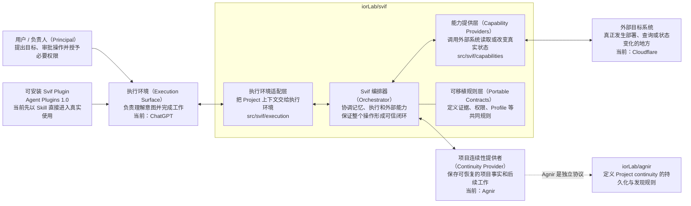
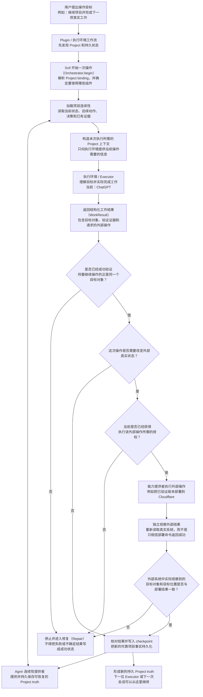

# Svif

[English](README.md) | **简体中文**

Svif 是一个 **Project orchestration（项目编排）产品**，负责协调持久化的 Project continuity、执行表面（Execution Surface）和能力提供者（Capability Provider）。

> Project 持续存在；Executor 和执行环境可以变化。

## 30 秒快速开始

### 新安装

只需要把下面这一句话交给你的 Agent：

```text
为这个 Project 安装并启用 Svif：https://github.com/iorLab/svif
```

这句话就是**面向用户的安装意图**。Agent 应自行检查本仓库、读取 [`plugin/README.md`](plugin/README.md)，识别当前执行环境实际支持的安装路径，并直接完成它有能力完成的安装步骤。用户不需要把 marketplace 路径、manifest 文件名、CLI 参数、同步规则、revision provenance 检查表或其他内部安装细节塞进提示词里。

如果当前执行环境确实要求 workspace 管理员 / owner 操作，或者存在只能通过产品 UI 完成的 policy 步骤，Agent 应只把这个无法代替用户完成的最小动作交给用户，而不是把整套内部安装 procedure 重新变成用户 checklist。只有真实受支持的 surface 已报告 Plugin 可用 / 已安装，并且安装后的 Plugin 已在真实 Project 上被实际调用，才可以把安装称为已验证。

Svif 当前使用 Agnir 作为首个 Continuity Provider。如果所选 Project 还没有初始化 Agnir，Agent 应先按照当前 Agnir 安装 / 激活 contract 建立所需的 Project continuity，再把 Svif Project operation 视为可用。

### 已经安装

**不需要在每次对话里重复 Svif 安装提示。** 只要把已经初始化 Agnir 的 Project 提供给执行环境，然后直接提出真正的 Project 任务即可。如果当前 surface 需要通过原生 Plugin 控件选择或启用 Svif，只需要针对相应 workspace / client 完成一次，而不是每次会话都重复安装 procedure。

## Agnir Project Instructions

把这个仓库根目录视为 Svif Project 的已授权 Project Entry Point。开始任何实质性 Project 工作之前：

1. 先读取根目录 `AGNIR.yaml`，校验声明的 Agnir Core / profile compatibility 与 Project identity。
2. 按 `AGNIR.yaml` 声明的位置加载 Current State 与 Next Actions。
3. 当 Decisions 与 Evidence 会约束本次操作时，再加载相关内容。
4. 默认以 Project 自己持久化的 Agnir truth 为准；只有更新的 Principal 指令或直接观察到的当前 Project 事实才能覆盖它，不要把聊天记录或 Executor 私有记忆当 canonical truth。
5. 对 Svif 本身进行开发时，再读取 `SVIF.yaml` 与本次变更相关的当前规格。
6. 保存进度或结束工作时，把重要的 state、next-action、decision 与 evidence 变化写回 checkpoint，并确认 locator chain 对全新的 Executor 仍能解析。

根目录 `AGENTS.md` 只负责把 Agent 引导到本节，不得成为第二份 Project state 或 Agnir procedure。期望的激活路径是：

`Project root -> AGENTS.md -> README.md / Agnir Project Instructions -> AGNIR.yaml -> declared durable memory`

如果 activation locator、Project identity、必需 memory locator 或 compatibility 校验任一失败，应在获得授权时修复最早出错的层；不得凭空补 Project state，也不得静默退回聊天历史、兄弟仓库或 retired layout。

## 架构图（Architecture Diagram）



Svif 自己负责的是这些可替换边界之间的协调。Orchestrator 并不永久依赖 Agnir、ChatGPT 或 Cloudflare；它们分别是 Continuity Provider、Execution Surface 和 Capability Provider 的首批/当前 binding。

当前 canonical repository 拓扑刻意保持最小：

- `iorLab/svif` —— 完整 Svif 产品，包括 Orchestrator、integrations、capability providers、可安装 Plugin、contracts、tests 和 E2E fixtures；
- `iorLab/agnir` —— 独立的 Agnir continuity protocol，Svif 通过 Continuity Provider interface 使用它。

Provider-specific 的 Svif 行为应留在 `iorLab/svif` 内，除非它未来本身成为一个具有独立价值的产品或协议。

## 运行流程（Runtime / Operation Flow）



默认内部生命周期为：

`DISCOVER -> PLAN -> CHANGE -> VERIFY -> DELIVER -> OBSERVE -> CHECKPOINT`

`REPAIR` 返回到最早被破坏的 invariant。对于 ChatGPT 这类 externally driven surface，`Orchestrator.begin()` 建立绑定后的 operation/session，`Orchestrator.complete()` 负责校验并 reconcile 返回结果。来自模型或结果 payload 的不可信数据不能自行授予 protected authority。

## 可安装 Plugin MVP

Svif 现在已经不是“以后再做 Plugin”，而是在 `plugin/` 中提供了第一版 **Skill-first Plugin MVP**，采用 Agent Plugins 1.0.0 的可移植目录格式；同时增加 OpenAI/Codex 专用的 GitHub marketplace 分发入口，但它不会取代 portable manifest：

```text
svif/
├── .agents/plugins/marketplace.json
└── plugin/
    ├── plugin.json
    ├── .codex-plugin/plugin.json
    ├── README.md
    └── skills/
        └── svif/
            └── SKILL.md
```

`plugin/plugin.json` 仍然是 Agent Plugins 1.0 portable manifest；`plugin/.codex-plugin/plugin.json` 是 OpenAI/Codex 产品侧分发 metadata，并复用同一份 `skills/`；`.agents/plugins/marketplace.json` 则把符合条件的 OpenAI workspace 的 GitHub marketplace import 映射到本仓库的 `./plugin`。

仓库现在已经具备当前官方文档支持的 GitHub marketplace 路径，但**真实 ChatGPT/Codex installation evidence 仍待补齐**。只有在具体真实受支持客户端 / workspace 上观察到 marketplace import report、installation policy、调用路径、Agnir activation、verification 与 checkpoint 行为后，才能把该 surface/revision 的安装称为已验证。

这版 Plugin 会要求 Executor 先发现 Agnir，再进入真实 Project 工作；执行过程中遵守 Svif lifecycle、exact-subject verification、provenance、可信权限边界、外部效果独立观察以及 durable checkpoint。Plugin 只是分发/工作流层，不会复制 Orchestrator，也不会把 ChatGPT 或其他执行环境变成 canonical memory。

第一版故意先不等 `mcp.json`。Skill-only package 可以先完成 portable conformance 并进入真实客户端 exercise；等远程 Svif MCP/App 边界可以正确复用 `Orchestrator.begin()` / `Orchestrator.complete()` 时，再把 MCP 作为增强组件并入，而不是继续把它当 package validation 或真实客户端 exercise 的前置条件。

portable package 检查、GitHub marketplace 分发路径、client-dependent installation exercise 与 evidence boundary 见 [`plugin/README.md`](plugin/README.md)。

## 仓库结构

下面这棵树就是仓库的实用导航。它不会穷举每一个测试 fixture 或 evidence 文件，只展开到足以说明“哪个目录负责什么、关键代码在哪里”的层级。

```text
svif/
├── .agents/plugins/                   # OpenAI/Codex GitHub marketplace catalog
│   └── marketplace.json              # 将 workspace import 映射到本仓库的 ./plugin
│
├── src/                              # Svif 可执行产品代码
│   └── svif/
│       ├── runtime.py                # Orchestrator 核心：begin/run/complete、验证、权限与结果核对
│       ├── continuity/               # Continuity Provider 的实现 / 适配层
│       │   └── agnir.py              # 当前首个实现：Agnir repository/filesystem 连续性提供者
│       ├── execution/                # Execution Surface 的桥接层
│       │   └── chatgpt.py            # 当前首个实现：ChatGPT 结构化执行桥接
│       └── capabilities/             # 读取或改变外部真实系统的 Capability Providers
│           └── cloudflare.py         # 当前首个实现：Cloudflare Workers Capability Provider
│
├── integrations/                     # 面向具体平台 / provider 的集成边界
│   ├── chatgpt/                      # ChatGPT app/MCP 集成，包在 execution bridge 外层
│   └── cloudflare/                   # Cloudflare descriptor、transport 边界和集成说明
│
├── plugin/                           # 可安装 Agent Plugins 1.0 分发包
│   ├── plugin.json                   # 可移植 Plugin manifest
│   ├── .codex-plugin/plugin.json     # OpenAI/Codex 产品侧的附加分发 metadata
│   ├── README.md                     # package/distribution validation、client exercise 与 evidence boundary 说明
│   └── skills/svif/SKILL.md          # Svif Project orchestration 工作流 Skill
│
├── spec/                             # Orchestrator 与 integrations 共同遵守的可移植产品 contracts
├── profiles/                         # 在通用 contracts 上叠加的专门化行为
├── schemas/                          # Svif contracts 的机器可读 serialization / schema
├── tests/                            # runtime、provider、surface、continuity、Plugin 与 founding E2E 测试
├── conformance/                      # 可移植 contract 的一致性检查和 fixtures
├── checks/                           # 检查整个仓库 / 产品结构是否仍满足既定边界
├── history/                          # 前身与已退休项目的历史证据；不属于 active runtime dependency
│
├── .agnir/                           # 这个 Svif Project 自己的 canonical state / next actions / decisions / evidence
├── .github/workflows/                # CI：运行 repository、runtime 和 conformance 检查
├── AGENTS.md                         # 最小 Agnir 激活 locator，指向英文 README 的 Project Instructions
├── AGNIR.yaml                        # 在当前 filesystem profile 下定位本 Project 的 Agnir continuity
├── SVIF.yaml                         # 本 Project 的 Svif Project Binding 的 repository/filesystem 表达
├── ARCHITECTURE.md                   # 更详细的产品架构、依赖方向和边界说明
├── README.md                         # 英文项目入口，并承载 canonical Agnir Project Instructions
├── README.zh-CN.md                   # 简体中文项目入口
└── VERSION                           # 当前 Svif development version
```

需要查看当前 `main` 的**完整文件级展开**，请看 **[完整目录树：REPOSITORY_TREE.md](REPOSITORY_TREE.md)**。

Python 目前只是可执行 reference vehicle，并不冻结未来的分发技术。可安装 Plugin 现在已经成为 active product artifact，而不是 future-only target。

## 当前 founding path

- 已有 Agnir repository/filesystem Continuity Provider adapter。
- 已有 ChatGPT structured execution bridge，支持 externally driven 的 `Orchestrator.begin()` / `Orchestrator.complete()` handoff。
- Cloudflare provider 已归 Svif 自己所有，并使用 injected transport boundary，因此测试不需要 live credentials。
- `tests/test_founding_e2e.py` 已把三者通过真实 Orchestrator 边界串起来。
- `plugin/plugin.json` + `plugin/skills/svif/SKILL.md` 继续构成 portable Plugin MVP package。
- `.agents/plugins/marketplace.json` + `plugin/.codex-plugin/plugin.json` 提供仓库直接支持的 OpenAI/Codex GitHub marketplace 路径；真实 ChatGPT/Codex installation evidence 仍待补齐。
- Plugin tests 现在同时约束 portable packaging、fixed-component discovery、Agnir pre-load discovery、installation claims 和 OpenAI distribution metadata，且不复制 runtime。
- Protected authority 不来自不可信的 model/result payload。
- 外部成功必须满足 exact verified-subject delivery，并经过 independent observation 后才能 checkpoint。

这个 founding E2E 刻意不使用真实 Cloudflare 凭据。它证明的是 Svif 产品闭环和各边界语义已经可执行，而不是声称已完成真实生产部署。

## Project binding

`SVIF.yaml` 是本 Project 对 `project-binding/0.2` 的 repository/filesystem serialization，同时登记当前 Svif 自己拥有的 Plugin artifacts，并保持 continuity、execution 和 capability bindings 可替换。

## 文档同步规则

`README.md` 与 `README.zh-CN.md` 是并行维护的项目入口。只要产品架构、组件归属、依赖方向、authority/provenance boundary、运行流程或仓库结构发生变化，**同一个 change set 必须同步更新两种语言版本**。

完整文件级结构由 **`REPOSITORY_TREE.md`** 维护。只要 tracked 文件被新增、删除、移动，或者职责发生实质变化，必须同步更新。

中文版图表继续遵循理解优先原则：节点优先让中文读者直接看懂“这个东西是什么、负责什么”，英文术语只作为括注或代码/API 名称保留。

## 检查

```bash
python checks/check_repository.py
python conformance/check_contracts.py
PYTHONPATH=src python -m unittest discover -s tests -v
```

## 下一步

下一里程碑已经不是“准备 Plugin packaging”。**Plugin 已经存在，并且仓库现在具备官方文档支持的 GitHub marketplace import 路径。** 接下来是在真实受支持客户端 / workspace 上导入这个 exact revision，记录 marketplace import result、exact surface/revision、Agnir activation、verification、checkpoint 和 evidence，再按真实 friction 修复；远程 ChatGPT MCP/App 组件随后再并入，但不得复制 kernel semantics 或削弱权限边界。真实 Cloudflare actuation 仍然单独受权限门控。